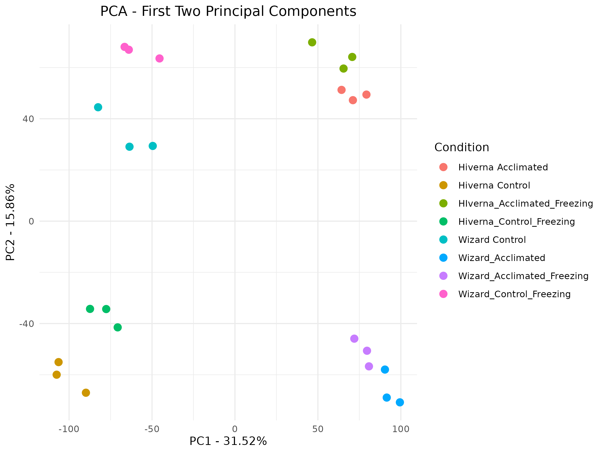
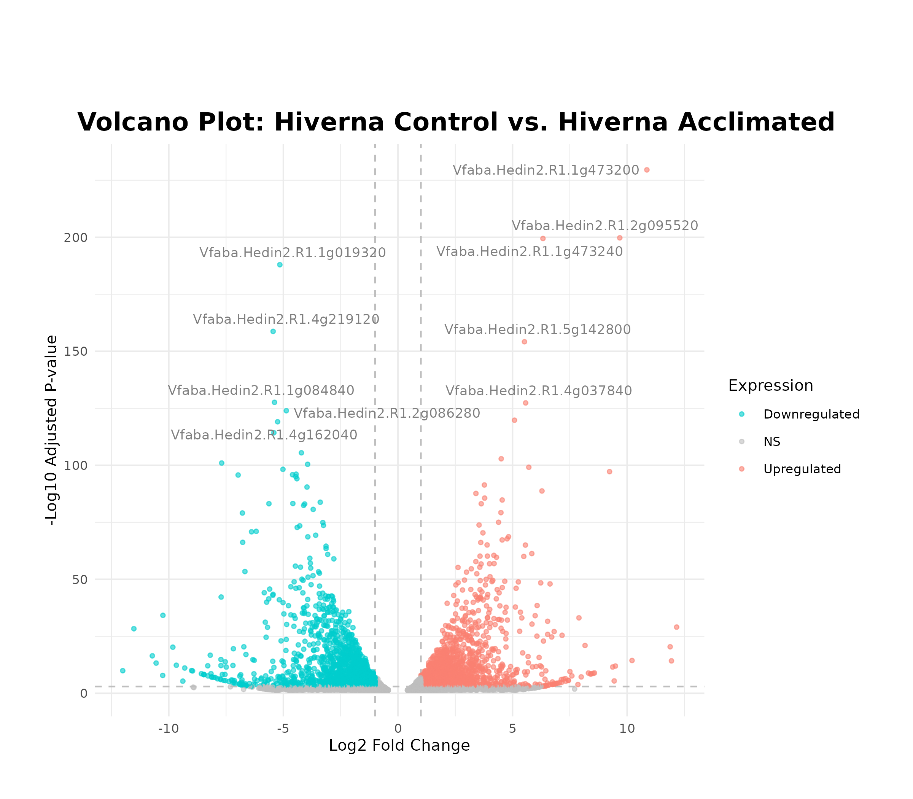
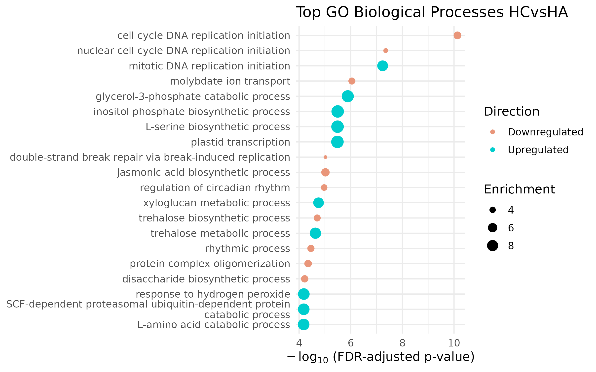

# RNA-seq Analysis of Faba Bean (Vicia faba) Cold Response

This repository contains scripts and documentation for RNA-seq analysis of **two Vicia faba genotypes**—**cold tolerant Hiverna(H))** and **cold susceptible WIzard (W)**—subjected to **four experimental conditions**:

- **C** – Control
- **A** - Acclimated
- **F** – Control + Freezing
- **AF** – Cold Acclimated + Freezing

The pipeline includes quality control, trimming, alignment to the faba bean genome, quantification, differential expression analysis, PCA, and GO pathway enrichment using soybean orthologs.

---

## 💻 HPC and Array Jobs
This project involved RNA-seq analysis of the faba bean genome (~13 Gb), a large and complex plant genome. Due to the computational demands of handling such a large dataset, the analysis was conducted on a High-Performance Computing (HPC) cluster using SLURM workload management.

To enable scalable and efficient processing, SLURM array jobs were used to efficiently parallelize the following tasks:
- Indexing the genome
- Aligning reads to the reference genome
- Functional Annotation to produce a counts matrix

This setup allowed for significant reductions in runtime and enabled the project to be reproducible and efficient at scale.

Subsequent steps — differential expression analysis (DEA) and gene ontology (GO) enrichment — were conducted using R Markdown for transparency and reproducibility.

All SLURM job scripts and R Markdown files are organized within the corresponding task folders in the pipeline structure (e.g., 01_alignment/, 02_annotation/, etc.).

## 📂 Project Structure

```text
.
├── 01_fastqc/ # FastQC Script
├── 02_trimmomatic/ # Trimmomatic Script and Script to combine fastqc files across lanes
├── 03_alignment/script/ # HISAT2 alignment + SAM to BAM conversion scripts
├── 04_indexing/indexing_array/ # SAMtools indexing script
├── 05_annotation/ # HTSeq-count script
├── 06_PCA/ # PCA R scripts and plots
├── 07_DEG_analysis/ # DESeq2 scripts, DEG lists, and volcano plots
├── 08_GO_analysis/ # GO enrichment scripts and pathway figures
└── README.md # This file
```

---

## 🧪 Experimental Design

- **Genotypes**: Cold Tolerant Hiverna (H) and Cold Susceptible Wizard (W)
- **Conditions**:
  - Control (C)
  - Acclimated (A)
  - Control + Freezing (F)
  - Cold Acclimated + Freezing (AF)
- **Groups**: 2 genotypes × 4 conditions = 8 comparisons
- **Replicates**: 
    - 3 technical replicates per sample = 24 total samples
    - Paired-end Illumina Sequencing Reads across 4 lanes = 192 fastq files total

---

## 🔬 Analysis Pipeline

### 1. Quality Control — FastQC

- Tool: [`FastQC`](https://www.bioinformatics.babraham.ac.uk/projects/fastqc/)
- Run on raw reads to identify poor quality regions and adapter contamination
- Output: `.html` and `.zip` reports

---

### 2. Read Trimming — Trimmomatic

- Tool: [`Trimmomatic`](http://www.usadellab.org/cms/?page=trimmomatic)
- Removes Illumina adapters, low-quality regions, and short reads
- Output: Paired/unpaired cleaned FASTQ files
- Combine paired output files across all four lanes

--- 

### 3. Alignment — HISAT2

- Tool: HISAT2
- Reference genome: Faba bean (Faba Bean Genome Consortium)
- Output: .sam alignment files

--- 

### 4. SAM to BAM Conversion & Indexing — SAMtools

- Tool: SAMtools
- Converts SAM to BAM, sorts, and indexes alignments

--- 

### 5. Read Counting — HTSeq-count

- Tool: HTSeq
- Uses aligned .bam files and GTF annotation to generate gene-level counts

---

### 6. PCA — Principal Component Analysis

- Tool: DESeq2 or prcomp() in R
- Visualizes variation between genotypes and conditions
- Output:


--- 

### 7. Differential Expression — DESeq2

- Tool: DESeq2
- Design formula: ~ condition + replicate 
- Output: DEG Lists and volcano plots
- Volcano Plot for HCvsHA:


---

### 8. GO Analysis

- 🧬 8.1 Ortholog Mapping
    - Tool: Ensembl Plants BioMart
    - Faba bean gene IDs converted to Glycine max orthologs for better annotation

- 🌱 8.2 Enrichment Analysis
    - Tool: GeneOntology.org
    - Input: up/downregulated gene lists
    - Output: enriched GO terms and pathway figures

- GO Analysis Enriched Pathways for HCvsHA condition:


--- 

- 📎 Dependencies
    - FastQC
    - Trimmomatic
    - HISAT2
    - SAMtools
    - HTSeq
    - R (DESeq2, ggplot2)
    - Internet access or scripts for Ensembl Plant BioMart/gene_ontology.org

- 🧠 Key Findings
    - PCA showed clear separation by genotype and condition.
    - Cold tolerant genotypes had unique transcriptomic signatures under acclimation and freezing conditions.
    - GO analysis highlighted pathways related to cold response, including reactive oxygen species (ROS) and hormone-related pathways (abscicic, salycilic and jasmonic acid). 

- ✍️ Author
    - This pipeline was developed for an MSc Bioinformatics group project on identifying transcriptomic cold tolerance mechanisms in Vicia faba.


